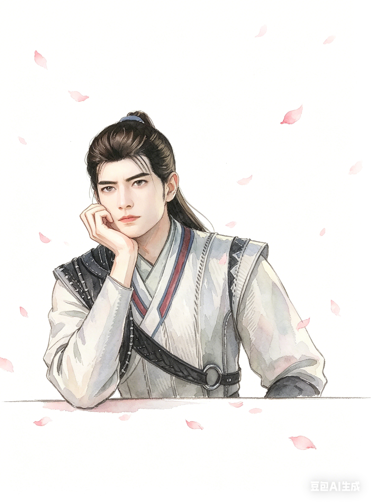
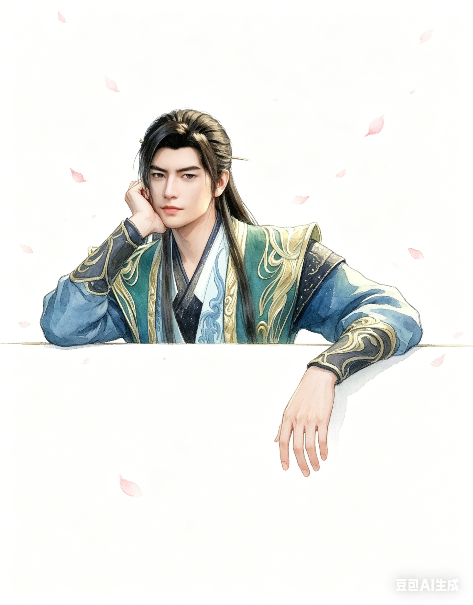

# 凡人修仙传 · 韩立 水彩风格背景图

## ✨ 最新版本（v2）
### 原图参考

### 生成效果

### 提示词
帮我生成图片：1:1正方形构图，图中人物探出上半身，其余被遮挡，一只肘撑在细细的横线上，手臂竖直，手掌掌心向上，托着下巴，另一只手臂自然垂落，两只手一高一低，人物靠左不要太大，慵懒的姿态，横线位置在画面下半部分三分之一处(横线以下留白干净)，突出人物。背景为纯白色，点缀些许飘落的粉色花瓣，线条干净流畅，平涂+柔和渐变上色，清新治愈的水彩质感，高细节，高完成度。原比例。

---

📁 点击查看历史版本（v1）

## v1 版本
### 原图参考

### 生成效果

### 提示词
1:1 正方形构图，图中人物探出上半身，其余被遮挡，一只手臂撑在细细的横线上，另一只手臂自然垂落，两只手一高一低，人物靠左不要太大，慵懒的姿态，横线位置在画面下半部分三分之一处（横线以下留白干净），突出人物。背景为纯白色，点缀些许飘落的粉色花瓣，线条干净流畅，平涂 + 柔和渐变上色，清新治愈的水彩质感，高细节，高完成度。原比例。

